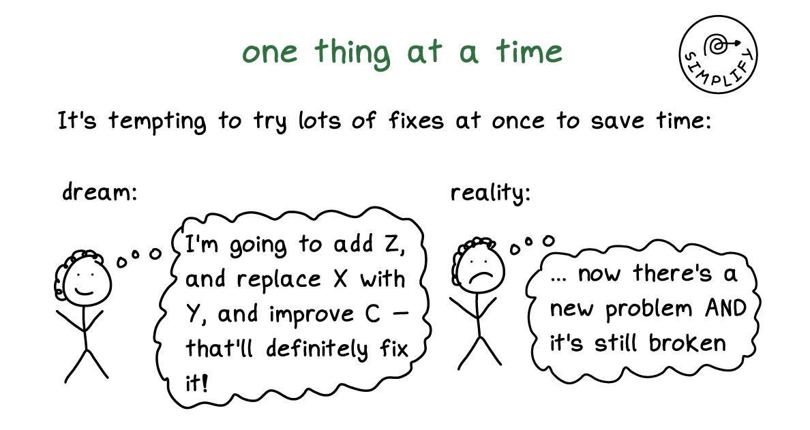

```{r setup, include=FALSE}
knitr::opts_chunk$set(
  fig.width = 6, 
  fig.height = 6 * 0.618, 
  fig.align = "center", 
  out.width = "90%",
  collapse = TRUE
)

library(tidyverse)
library(gapminder)
library(scales)
```

```{r ffmpeg-note, eval=FALSE, include=FALSE}
# Convert Quicktime-created .mov files to .mp4
# > ffmpeg -i input.mov output.mp4
```

Lots of the code you run in this class is actually a big long chain of functions or plot layers, like {dplyr} functions that are all connected with `|>`s or {ggplot2} functions that are all connected with `+`s.

Inevitably, something will go wrong at some point in the chain—often a misspelled word or a misplaced comma or a misplaced parenthesis. Tracking down (or debugging) the issue can be often be tricky! 

For example, **four (4)** things are wrong in this code. See if you can spot them without running it—good luck!

```{r gdp-broken, eval=FALSE}
gapminder_gdp_thing <- gapminder |> filter(year > 1990) |> 
  mutate(gdp_total = gdpPercap * pop),
     is_africa = ifelse(continent == "Africa", 
"Is Africa", "Isn't Africa"))) |>  
           group_by(year, continent) |> 
  mutate(gdp_above_continent_median = 
           ifelse(gdp_total > median(gdp_total)), TRUE, FALSE)) |>
ungroup() |> arrange(desc(gdp_total)) |>
  mutate(continent = fct_inorder(continent) = country = fct_inorder(country))
```

::: {.callout-note collapse="true"}
#### Click here for the answers

```{r gdp-broken-answer, eval=FALSE}
gapminder_gdp_thing <- gapminder |> filter(year > 1990) |> 
  mutate(gdp_total = gdpPercap * pop),  # <1>
     is_africa = ifelse(continent == "Africa", 
"Is Africa", "Isn't Africa"))) |>  # <2>
           group_by(year, continent) |> 
  mutate(gdp_above_continent_median = 
           ifelse(gdp_total > median(gdp_total)), TRUE, FALSE)) |>  # <3>
ungroup() |> arrange(desc(gdp_total)) |>
  mutate(continent = fct_inorder(continent) = country = fct_inorder(country))  # <4>
```

1. There's a closing parenthesis after `pop)` that shouldn't be there—it ends the `mutate()` too early and `is_africa = BLAH` ends up not being inside `mutate()`
2. There's an extra parenthesis at the end of `"Isn't Africa")))`
3. There's an extra parenthesis after `median(gdp_total))`
4. There's an `=` instead of a comma in between `fct_inorder(continent)` and `country`

Here's what the fixed, reindented version looks like:

```{r gdp-broken-fixed}
gapminder_gdp_thing <- gapminder |> 
  filter(year > 1990) |> 
  mutate(
    gdp_total = gdpPercap * pop,  # <1>
    is_africa = ifelse(
      continent == "Africa", 
      "Is Africa", 
      "Isn't Africa") # <2>
  ) |>  # <2>
  group_by(year, continent) |> 
  mutate(
    gdp_above_continent_median = ifelse(
      gdp_total > median(gdp_total), 
      TRUE, 
      FALSE)  # <3>
  ) |>  # <3>
  ungroup() |> 
  arrange(desc(gdp_total)) |>
  mutate(continent = fct_inorder(continent), 
         country = fct_inorder(country))  # <4>
```

1. Fixed!
2. Fixed!
3. Fixed!
4. Fixed!

:::

It's nearly impossible to figure out what's wrong here without running it. And even if you do run it, you'll get somewhat cryptic errors.

I have two important techniques and tips that fix 90% of my debugging problems:

1. Slow down, simplify, and do small things
2. Reformat the code by reindenting it and breaking it into multiple lines
3. Run the code incrementally, line by line

Each of these techniques help track down issues in the code above and are good skills to know in general. I’ll explain each approach and give a little video demonstration below.

### Slow down, simplify, and do small things

It is *incredibly* tempting to write out all the code you want in one go and then try to run a complete chunk and hope that you got it all correct. And then when it's not correct, you try to change a bunch of things, hoping that they'll fix it and then they don't and you stay stuck and frustrated. You'll have a chunk of code that was 20–30 lines with an error somewhere and won't be able to find what went wrong or what was broken.

**Don't do this!**

Here's my best piece of advice for making more complex plots and for figuring out how to fix errors:

> **Slow down, simplify, and do small things**

[Run your code incrementally](#run-the-code-incrementally). Start with a super basic plot and run it, then add a layer for labels and run it, then add a layer to change the fill gradient and run it, then add a layer to change the theme and run it, and so on. It feels slow, but it helps you understand what's going on and helps you fix things when they break.

This is not just my advice. [Julia Evans's](https://jvns.ca/) fantastic [*The Pocket Guide to Debugging*](https://wizardzines.com/zines/debugging-guide/) has the same piece of advice:



When something doesn't work as expected, change just one thing at a time. Or even better, simplify it and then change one thing at a time.

Here's a quick common example. Let's say you have a plot like this and you want to use the [plasma viridis scale](https://cran.r-project.org/web/packages/viridis/vignettes/intro-to-viridis.html#the-color-scales) for the colors of the points. It looks like it should work, but the colors aren't right! Those are just the default colors!

```{r example-broken, warning=FALSE, message=FALSE}
library(tidyverse)

ggplot(data = mpg, mapping = aes(x = displ, y = hwy, color = drv)) +
  geom_point() +
  labs(x = "Displacement",
       y = "Highway MPG",
       color = "Drive") +
  scale_fill_viridis_d(option = "plasma", end = 0.9) +
  theme_minimal() +
  theme(legend.position = "bottom")
```

Here's the process I would go through to figure out what's wrong and fix it:

::: {.panel-tabset .nav-pills}
#### 1. Strip it down to a basic plot

Right now there are a bunch of other layers (themes, labels, etc.). Maybe one of those is messing stuff up? We want to make sure the underlying plot works fine, so we'll strip down the plot to its simplest form—just the geoms

```{r step-1, warning=FALSE, message=FALSE}
ggplot(data = mpg, mapping = aes(x = displ, y = hwy, color = drv)) +
  geom_point()
```

#### 2. Add simplified broken part

Good, that works. Next we want to change the colors so that they use the viridis plasma palette. We used `scale_fill_viridis_d()` originally, but we also included a bunch of extra options (`option = "plamsa", end = 0.9`). Before using those, let's simplify it down and just use the default settings:

```{r step-2}
ggplot(data = mpg, mapping = aes(x = displ, y = hwy, color = drv)) +
  geom_point() +
  scale_fill_viridis_d()
```

#### 3. Figure out broken part

The colors still didn't change. But now we have a simplified working example of our broken code and we can examine it without worrying about the labels, themes, extra options, and all those other things. This should make it easier to see what's going on.

The issue here is that we used the color aesthetic (`color = drv`) and we're trying to change it with `scale_fill_*()`. That lets us control filled things (i.e. `fill = drv`). Since we're working with the color aesthetic, we need to use `scale_color_*()`. Let's try `scale_color_viridis_d()` and see if that fixes it:

```{r step-3}
ggplot(data = mpg, mapping = aes(x = displ, y = hwy, color = drv)) +
  geom_point() +
  scale_color_viridis_d()
```

#### 4. Add some parts back in

That fixed it! It's still not exactly what we wanted yet—we want the plasma palette and `end = 0.9`—but it's working now and we can add that back in: 

```{r step-4}
ggplot(data = mpg, mapping = aes(x = displ, y = hwy, color = drv)) +
  geom_point() +
  scale_color_viridis_d(option = "plasma", end = 0.9)
```

#### 5. Add the rest back in

Cool, the palette changed and the other settings worked. The problem seems to be fixed now, so we can re-add all those other layers from the original plot. It's fixed!

```{r step-5}
ggplot(data = mpg, mapping = aes(x = displ, y = hwy, color = drv)) +
  geom_point() +
  labs(x = "Displacement",
       y = "Highway MPG",
       color = "Drive") +
  scale_color_viridis_d(option = "plasma", end = 0.9) +
  theme_minimal() +
  theme(legend.position = "bottom")
```

:::


### Reformat the code

In the [R style suggestions in the Resources section](/resource/style.qmd#pipes-and-ggplot-layers), it explains that each layer of a `|>`-chained pipeline or ggplot plot should be on separate lines, with the `|>` or the `+` at the end of the line, indented with two spaces.

```{r eval=FALSE}
ggplot(data = blah, mapping = aes(x = thing, y = thing2)) +
  geom_point() +
  geom_smooth(method = "lm") +
  scale_x_continuous() +
  theme_minimal()
```

Additionally, it's often a good idea to add lines in between the arguments inside functions and line them up within the `()`s of the function.

This makes it so you can clearly see each step of the pipeline or plot, and you can clearly see each of the arguments inside each function.

People tend to take one of two approaches to argument alignment—aligning argument names at the same level as the opening `(` of the function like this:

```{r eval=FALSE}
some_object <- some_dataset |>
  a_function() |>
  another_function(argument = 1,
                   argument = 2,
                   argument = some_function(thing1 = "a", 
                                            thing2 = "b")) |>
  yet_another_function()
```

…or aligning argument names two spaces to the right of where the argument starts, like this:

```{r eval=FALSE}
some_object <- some_dataset |>
  a_function() |>
  another_function(
    argument = 1,
    argument = 2,
    argument = some_function(
      thing1 = "a", 
      thing2 = "b"
    )
  ) |>
  yet_another_function()
```

RStudio can actually reindent code for you automatically, and it can use either of these approaches. If you want the first approach (where argument names align after the opening `(`), check "Tools > Global Options > Code > Vertically align arguments in auto-indent"; if you want the second approach (where argument names are all a little indented from where the argument starts), make sure that option is unchecked.

To have RStudio reindent code for you, select the code you want to be reindented and go to "Code > Reindent lines", or use the keyboard shortcut <kbd>⌘I</kbd> on macOS or <kbd>ctrl + I</kbd> on Windows.

Here's what that looks like. Notice how distorted the indentation is initially—RStudio is smart enough to fix it all:

::: {.panel-tabset}
#### With keyboard shortcut

```{=html}
<div class="ratio ratio-16x9">
<video controls width="100%">
  <source src="video/reindent-keyboard.mp4" type="video/mp4">
</video>
</div>
```

#### With menu

```{=html}
<div class="ratio ratio-16x9">
<video controls width="100%">
  <source src="video/reindent-menu.mp4" type="video/mp4">
</video>
</div>
```

#### Without vertical argument alignment

```{=html}
<div class="ratio ratio-16x9">
<video controls width="100%">
  <source src="video/reindent-no-vertical-alignment.mp4" type="video/mp4">
</video>
</div>
```

:::

Not only does reindentation make it easier to read your code, it can reveal issues with the code. Remember that code from the beginning of this post with four things wrong? If we reindent it, the line that starts with `is_africa = ifelse(` is indented funny—it gets put at the start of the line, when really it should be at the same level as `gdp_total`, since those are both arguments for the `mutate()` function. If you look at the line above, you'll see that there's a `)` after `gdpPercap * pop`, which closes `mutate()` prematurely, so `is_africa` isn't actually inside `mutate()`. If we get rid of the `)` at the end of `pop` and reindent again, `is_africa` shows up in the right place.

```{=html}
<div class="ratio ratio-16x9">
<video controls width="100%">
  <source src="video/reindent-gapminder.mp4" type="video/mp4">
</video>
</div>
```

\ 

::: {.callout-tip}
#### Extra strength formatting

Reindenting your code only shifts things around horizontally. If you want more powerful code reformatting, try using "Code > Reformat Code" (or use <kbd>⌘⇧A</kbd> on macOS or <kbd>ctrl + shift + A</kbd> on Windows). It's a more aggressive form of reformatting that will add extra line breaks and other things to make the code more readable:

```{=html}
<div class="ratio ratio-16x9">
<video controls width="100%">
  <source src="video/code-reformat.mp4" type="video/mp4">
</video>
</div>
```

\ 

It doesn't fix everything—there should be a line break after each `|>` in that example ↑ so you'd need to add your own line break before `filter(year > 1990)` and `arrange(desc(gdp_total))`, but it works well.
:::

I'd recommend trying to keep things indented consistently as you write your code, and periodically reindenting stuff just to make sure everything is nice and aligned. Ultimately R doesn't care how your code is indented (other languages do, like Python, where one errant space can mess up everything), but humans do care and nicer indentation will help others (and future you!).


### Run the code incrementally

Your code is often a series of functions or layers connected with `|>` or `+`. If something goes wrong at any step in the chain of functions, your code won't work. When that happens, the best strategy for figuring out what went wrong is to *run the code incrementally*. Just run a few layers of it at a time and then check to see how it looks. Run the first two lines, look at the results, make sure it worked, the run the first three lines, look at the results, make sure it worked, and so on.

This is also a good approach for writing your code initially. That big gapminder-based plot at the beginning of this post? I didn't write that all at once. I started with the initialy `ggplot() + geom_point()`, ran it, then added another layer or two, ran it with those, then added some more layers or changed some settings inside existing layers, then ran it with those, and so on until the whole thing was built.

There are a couple ways to do this. One way is to select just the code you want to run (like from the beginning of `ggplot()` to *right before* a `+` on some layer), then press <kbd>⌘ + return</kbd> on macOS or <kbd>ctrl + enter</kbd> on Windows to run just that selection. If it worked as expected, select from the beginning again (i.e. at `ggplot()`) and go to *right before* a `+` on some other layer and run that selection:

```{=html}
<div class="ratio ratio-16x9">
<video controls width="100%">
  <source src="video/line-by-line-select.mp4" type="video/mp4">
</video>
</div>
```

\ 

If you don't want to keep using your mouse and want to keep your hands at your keyboard, you can add a `#` right before a `+` or `|>` to comment it out. That essentially breaks the chain of functions at that point, so when you type <kbd>⌘ + return</kbd> or <kbd>ctrl + enter</kbd>, R only runs the code up to that point. Then you can remove the `#`, put it before another `+` or `|>`, and run it again.

```{=html}
<div class="ratio ratio-16x9">
<video controls width="100%">
  <source src="video/line-by-line-comments.mp4" type="video/mp4">
</video>
</div>
```

\ 

Here's what my typical process for dealing with weirdly indented, broken code looks like. I try to run the whole thing initially, then when it breaks, I reindent it to see if anything is obvious from that. Then I start running it incrementally and check the results of each step to make sure it works up to that point. I do that over and over until the whole pipeline works.

```{=html}
<div class="ratio ratio-16x9">
<video controls width="100%">
  <source src="video/full-debug-line-by-line.mp4" type="video/mp4">
</video>
</div>
```
