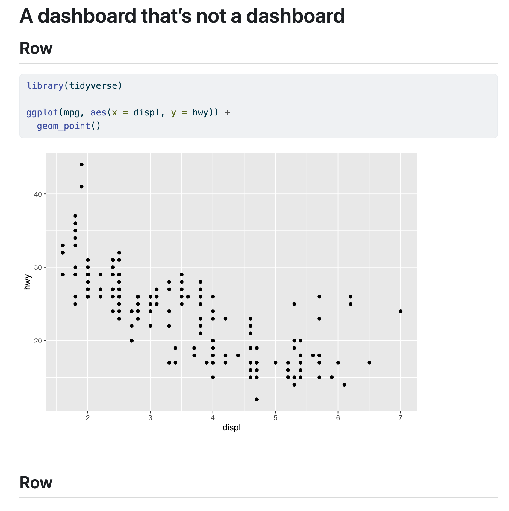
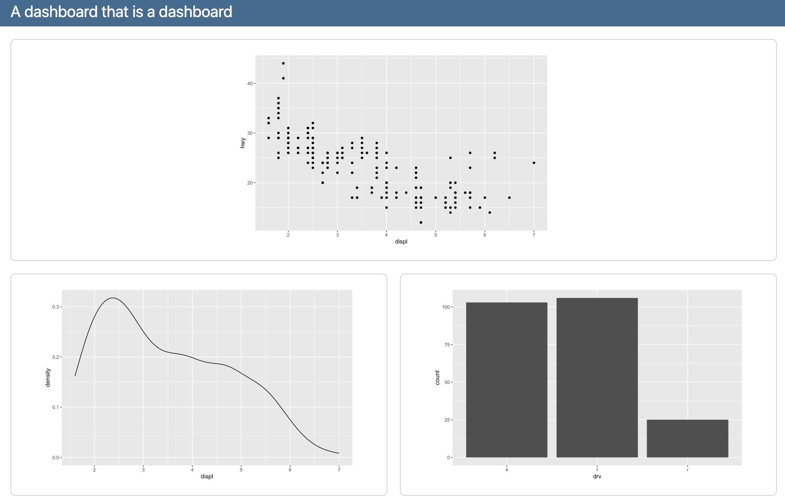
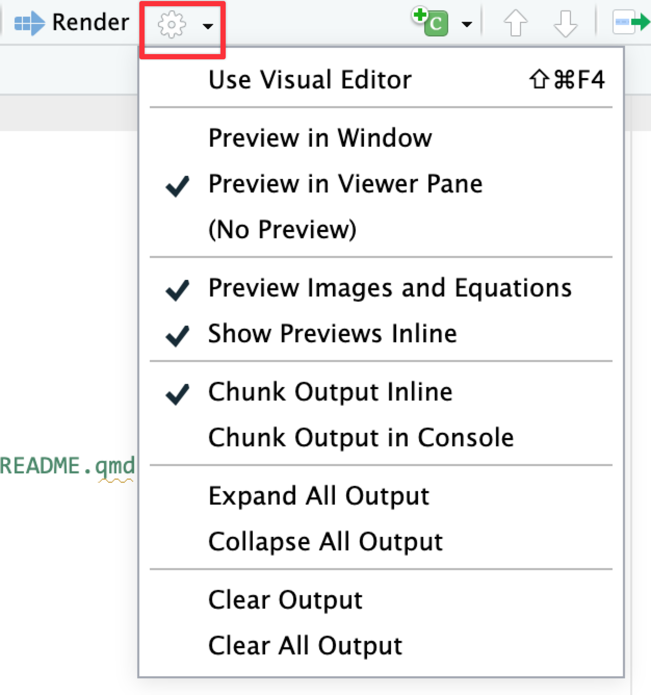
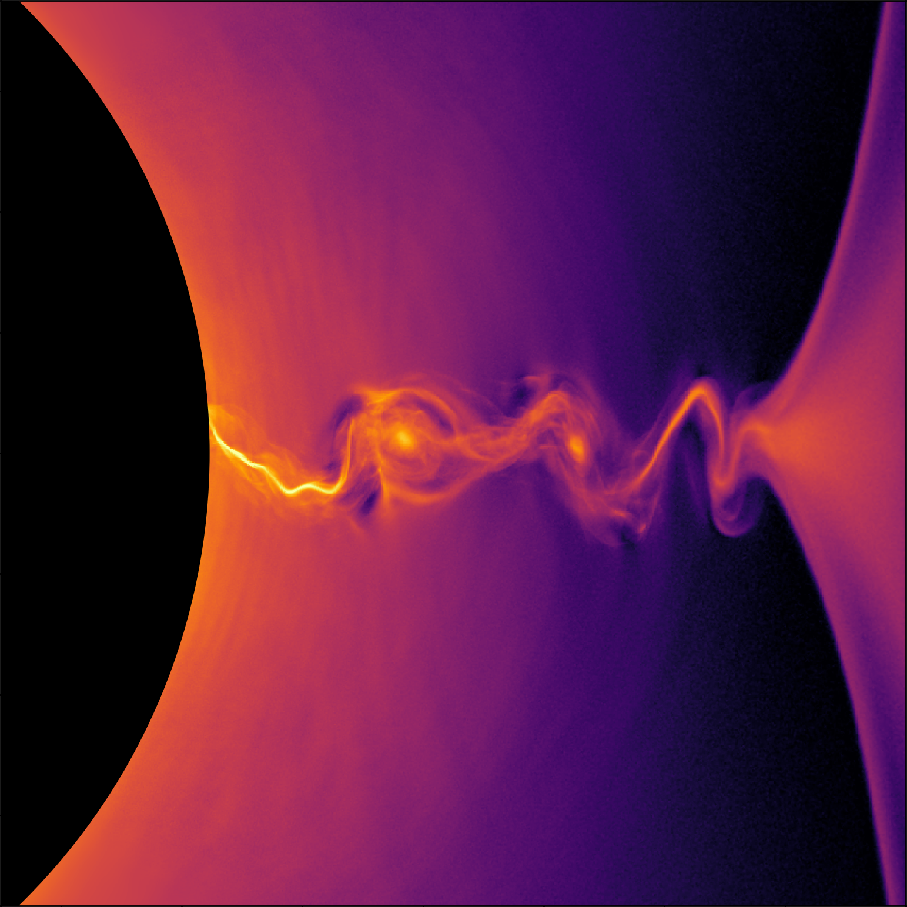
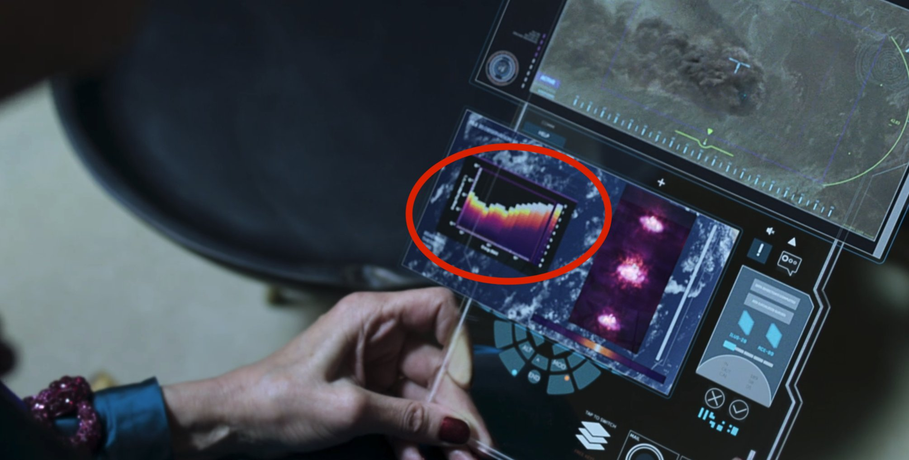
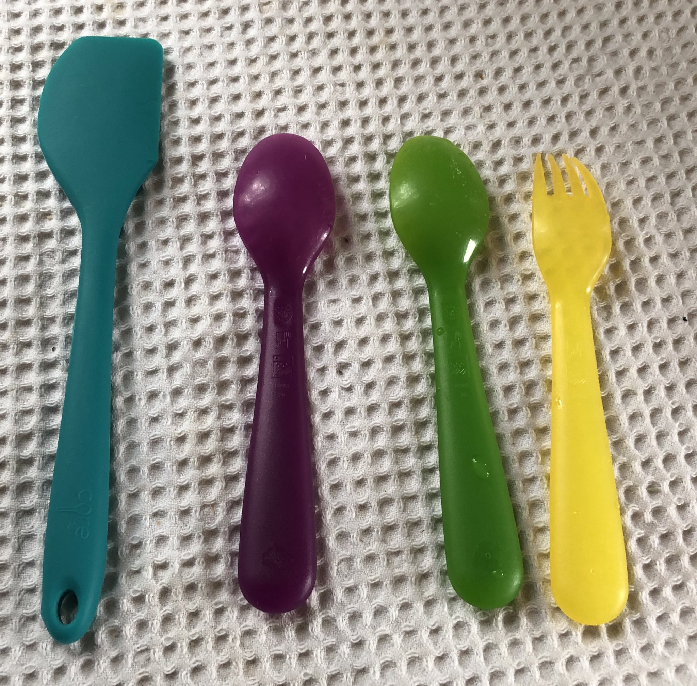

```{r setup, include=FALSE}
knitr::opts_chunk$set(
  fig.width = 6,
  fig.height = 6 * 0.618,
  fig.align = "center",
  out.width = "90%",
  collapse = TRUE
)

options(
  digits = 3, width = 120,
  dplyr.summarise.inform = FALSE
)
```

Hi everyone!

Great work with your dashboards! Quarto dashboards are a super new feature (like, they were only added in January 2024), and you're one of the first R classes to make them as part of an assignment. You're on the cutting edge!

Just a few quick FAQs and tips for this session:


### Do people use Plotly and Quarto dashboards in the real world?

In the lecture I mentioned that most COVID dashboards were/are made with Shiny or {flexdashboard}. Both are still extremely popular and you'll see Shiny and {flexdashboard} websites all over the internet.

Organizations have been moving to Quarto too. In November 2024, Idaho launched a [new election results dashboard](https://archive.voteidaho.gov/results/2024/general/) for its general election results and it's 100% built with Quarto and Plotly. 

And now you can all do similar, real world things too!


### My plot didn’t translate perfectly to ggplotly—why?

In session 11 you used `ggplotly()` to convert a ggplot object into an interactive plot, which I think is magical:

```{r basic-plotly, warning=FALSE, message=FALSE}
library(tidyverse)
library(plotly)
library(palmerpenguins)
penguins <- penguins |> drop_na(sex)

basic_plot <- ggplot(penguins, aes(x = bill_length_mm, y = body_mass_g, color = species)) +
  geom_point()

ggplotly(basic_plot)
```

\ 

However, lots of you discovered that Plotly does not translate everything perfectly. Plotly is a separate Javascript library and it doesn’t support every option ggplot does. `ggplotly()` tries its best to translate between R and Javascript, but it can’t get everything. For instance, subtitles, captions, and labels disappear:

```{r fancy-plotly-stuff-missing, warning=FALSE}
fancy_plot <- ggplot(penguins, aes(x = bill_length_mm, y = body_mass_g, color = species)) +
  geom_point() +
  annotate(geom = "label", x = 50, y = 5500, label = "chonky birds") +
  labs(title = "Penguin bill length and weight",
       subtitle = "Neato", 
       caption = "Here's a caption")

ggplotly(fancy_plot)
```

\ 

That’s just a limitation with ggplot and plotly. If you want a perfect translation, you’ll need to hack into the guts of the translated Javascript and HTML and edit it manually to add those things.

Alternatively, you can check out other interactive plot packages. [{ggiraph}](https://davidgohel.github.io/ggiraph/) makes really great and customizable interactive plots (and it supports things like subtitles and captions and labels and other annotations ggplotly can't), but with slightly different syntax:

```{r ggiraph-thing}
library(ggiraph)

plot_thing <- ggplot(data = penguins) +
  geom_point_interactive(aes(x = bill_length_mm, y = body_mass_g, color = species,
                             tooltip = species, data_id = species)) +
  annotate(geom = "label", x = 50, y = 5500, label = "chonky birds") +
  labs(title = "Penguin bill length and weight",
       subtitle = "Neato", 
       caption = "Here's a caption")

girafe(ggobj = plot_thing)
```


### I tried to render a dashboard but it appeared as a regular HTML file—why?

Lots of you submitted a dashboard for Task 3 that looked like a regular HTML file, [like this](https://andrewheiss.quarto.pub/a-dashboard-thats-not-a-dashboard/):

{.border}

That's because the document was missing the `format: dashboard` option, which tells Quarto to render it in a special dashboard-y way. Your top metadata probably looked like this:

````markdown
---
title: "Some title"
---

## Row

```{{r}}
#| warning: false
#| message: false
library(tidyverse)

ggplot(mpg, aes(x = displ, y = hwy)) +
  geom_point()
```
````

To fix it, add `format: dashboard` to the metadata area:

````markdown
---
title: "Some title"
format: dashboard
---
````

It should now look [like this](https://andrewheiss.quarto.pub/a-dashboard-that-is-a-dashboard/):

{.border}


### When should we use a dashboard vs. a full Shiny app?

Shiny is a really neat R package that lets you run fully interactive web applications in a browser. It runs R code behind the scenes to calculate stuff and generate plots, and it's powerful and cool. 

But it also is complex and requires a full server to run. You can't just render a .qmd file as a Shiny app and share the resulting HTML with someone—you can't even publish Shiny apps to Quarto Pub (you can publish it to [shinyapps.io](https://www.shinyapps.io/), but they only let you have one free app, since they're so resource intensive). 

You need to use Shiny if you need things to be recalculated on the page, like if you want users to change some settings and have those be reflected in a plot, or if you want the page to show the latest version of live data from some remote data source. Because R runs behind the scenes, it'll redraw plots and re-import data and rebuild parts of the web page as needed.

If you don't need things to be reclaculated on the page, you can just use a regular dashboard, like in Exercise 11. There's no need for fancy server backend stuff—nothing needs to be recalculated or replotted or anything.

If you have things that need to be recalculated/replotted and you *don't* want to use Shiny (which is totally understandable! it's a tricky complex package!), Quarto has support for something called [Observable JS](https://quarto.org/docs/interactive/ojs/), which is essentially a Javascript version of {ggplot2} and {dplyr} and R. It runs stuff directly in your browser without needing a whole server—documents with Observable JS (OJS) chunks can be published on Quarto Pub. You can even mix R and OJS chunks in the same document.

Like, watch this magic.

Here's an R chunk that loads gapminder data and penguin data and then makes them available to OJS:

```{r}
#| echo: fenced
library(gapminder)
library(palmerpenguins)

ojs_define(gapminder = gapminder, penguins = palmerpenguins::penguins)
```

And here's an OJS chunk that filters the gapminder data and plots it in an interactive way. You can slide that year slider and have it replot things automatically—no need for Shiny!

::: {.callout-note}
#### Observable
This is NOT R code! This is [Observable JS](https://quarto.org/docs/interactive/ojs/) code!
:::

```{ojs}
//| echo: fenced
viewof current_year = Inputs.range(
  [1952, 2007], 
  {value: 1952, step: 5, label: "Year:"}
)

// Rotate the data so that it works with OJS
gapminder_js = transpose(gapminder)

// Filter the data based on the selected year
gapminder_filtered = gapminder_js.filter(d => d.year == current_year)

// Plot this thing
Plot.plot({
  x: {type: "log"},
  marks: [
    Plot.dot(gapminder_filtered, {
        x: "gdpPercap", y: "lifeExp", fill: "continent", r: 6,
        channels: {
          Country: d => d.country
        },
        tip: true
      }
    )
  ]}
)
```

And here's an OJS plot that filters the penguins data based on user input and plots it as facetted histograms:

```{ojs}
//| echo: fenced
viewof bill_length_min = Inputs.range(
  [32, 50], 
  {value: 35, step: 1, label: "Bill length (min):"}
)
viewof islands = Inputs.checkbox(
  ["Torgersen", "Biscoe", "Dream"], 
  { value: ["Torgersen", "Biscoe"], 
    label: "Islands:"
  }
)

// Rotate the data so that it works with OJS
penguins_js = transpose(penguins)

// Filter the data
filtered = penguins_js.filter(function(penguin) {
  return bill_length_min < penguin.bill_length_mm &&
         islands.includes(penguin.island);
})

// Plot the data
Plot.rectY(filtered, 
  Plot.binX(
    {y: "count"}, 
    {x: "body_mass_g", fill: "species", thresholds: 20}
  ))
  .plot({
    facet: {
      data: filtered,
      x: "sex",
      y: "species",
      marginRight: 80
    },
    marks: [
      Plot.frame(),
    ]
  }
)
```

That's so cool!

You can do a ton of neat interactive things—without Shiny!—with Observable JS. See these, for instance:

- [USAID's Foreign Assistance dashboard](https://foreignassistance.andrewheiss.com/live-example-dashboard.html)
- [Reading dashboard that pulls data from Goodreads and Google Sheets](https://www.andrewheiss.com/blog/2024/01/12/diy-api-plumber-quarto-ojs/_book/dashboard.html)
- [Making maps with Observable Plot](https://www.andrewheiss.com/blog/2025/02/10/usaid-ojs-maps/)
- [Quarto's OJS documentation](https://quarto.org/docs/interactive/ojs/)


### I rendered my file / dashboard but it didn't appear in the Viewer panel—why not?

When you render a Quarto file, RStudio will show you a preview of it. Depending on how RStudio is set up, that preview can appear in the Viewer panel, or it can appear in a separate web browser window. Both options are helpful and I use them interchangeably—if I'm at home with my wider monitor, I'll have the preview appear in a separate window on the side of my screen; if I'm just on my laptop, I'll have the preview appear in the Viewer panel.

You can control where it appears with the little gear icon next to the "Render" button in RStudio:

{width="40%"}

There are other options there too. If you don't like having plots appear underneath chunks inside your document, you can tell it to show "Chunk Output in Console". This will put plots in the Plots panel instead.


### Do people use viridis palettes in real life?

Yes! Now that you know [what the viridis palettes look like](https://cran.r-project.org/web/packages/viridis/vignettes/intro-to-viridis.html#the-color-scales), you'll notice them in all sorts of reports and papers and visualizations.

For instance, check out [this paper on black hole plasma](https://newscenter.lbl.gov/2019/01/24/how-to-escape-a-black-hole-simulations-provide-new-clues-to-whats-driving-powerful-plasma-jets/)—that's the "magma" scale:

{width="70%"}

They pop up in fiction too! In [S4E5 of *The Expanse*](https://www.imdb.com/title/tt8665822/) (and throughout the show, actually), you can see charts on futuristic iPads using the "plasma" scale:



Back in March 2020 I even found a wild `scale_color_viridis_d()` on my kitchen counter :)

{width="80%"}


### I'm bored with ggplot's default colors and/or viridis—how can I use other color palettes?

[There's a guide to using all sorts of different colors](/resource/colors.qmd), including how to use fancy scientifically-designed palettes, custom colors from organizations like GSU, and colors from art, music, movies and TV shows, and historical events. You can make gorgeous plots with these different colors!
