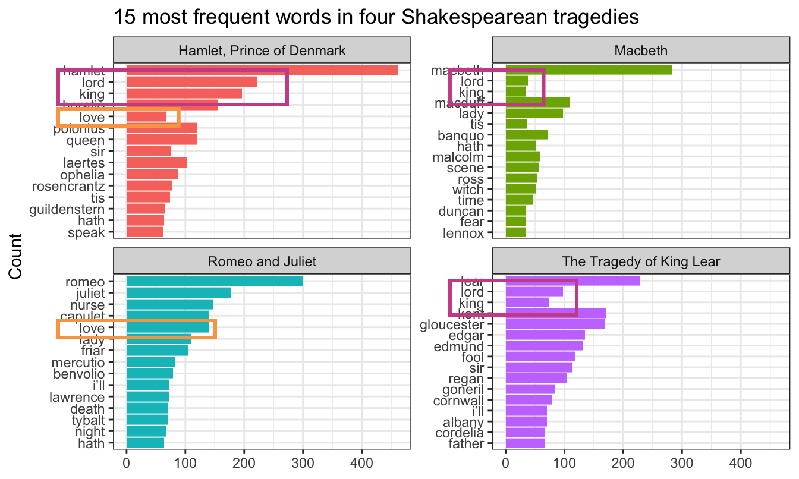

```{r setup, include=FALSE}
knitr::opts_chunk$set(
  fig.width = 6, 
  fig.height = 6 * 0.618, 
  fig.align = "center", 
  out.width = "90%",
  collapse = TRUE
)
```

Hi everyone!

Just a few tips/FAQs for these last couple sessions:

### Why doesn't gapminder data appear in the environment panel? Is there a way to see which packages have which data?

Throughout the course, you've been loading data into R from external things like CSV files and Excel files. You've also loaded lots of built-in data from R packages, like `gapminder` and `penguins`. These behave a little differently from file-based datasets.

R comes with a bunch of built-in datasets that you can use immediately without needing to load any packages, like these:

- `mtcars`: Motor Trend Car Road Tests
- `faithful`: Old Faithful Geyser Data
- `ToothGrowth`: The Effect of Vitamin C on Tooth Growth in Guinea Pigs
- `Titanic`: Survival of passengers on the Titanic

You can use these datasets immediately by running their name:

```{r}
ToothGrowth |> head()
```

However, these don't appear in the environment panel until you do one of two things. You can either explicitly load the data into the environment using `data(NAME_OF_THING)`:

```{r}
# Option 1: Explicitly load the data into the environment
data(ToothGrowth)
```

Or you can make a copy of the invisible dataset with `<-`:

```{r}
# Option 2: Make a copy of the data
guinea_pig_tooth_stuff <- ToothGrowth
```

R packages can also come with data. For example, you've been using the `mpg` dataset a lot throughout the course. That comes with the {ggplot2} package. Once you run `library(ggplot2)` (or `library(tidyverse)`, since that loads {ggplot2} for you), you'll have access to `mpg`. If you want it to show up in the environment panel, you can do this:

```{r}
library(ggplot2)
data(mpg)
```

*Technically*, you don't even need to load the package. You can use `data()` to load a dataset from a specific package, so you could do this without loading {ggplot2}:

```{r}
data(mpg, package = "ggplot2")
```

Similarly, if you want `gapminder` to show up in the environment panel, you can do this:

```{r}
library(gapminder)
data(gapminder)
```

Or this:

```{r}
data(gapminder, package = "gapminder")
```

Or you can just know that there's a dataset in {gapminder} named `gapminder` and start using it without explicitly running `data(gapminder)`. 

All three of these approaches do the same thing:

::: {.panel-tabset}
#### Load package, then load data with `data()`

```{.r}
library(tidyverse)
library(gapminder)

# Load the gapminder data into the Environment panel
data(gapminder)

# Do stuff with it
gapminder_2007 <- gapminder |> 
  filter(year == 2007)
```

#### Load data with `data()` without loading the package

```{.r}
library(tidyverse)

# Load the gapminder data into the Environment panel *without* loading the package
data(gapminder, package = "gapminder")

# Do stuff with it
gapminder_2007 <- gapminder |> 
  filter(year == 2007)
```

#### Load the package and trust that `gapminder` exists

```{.r}
library(tidyverse)
library(gapminder)

# Do stuff with gapminder because it exists invisibly already from running `library(gapminder)
gapminder_2007 <- gapminder |> 
  filter(year == 2007)
```
:::

---

But how do you know what datasets packages have? Like, how would you even know that `mpg` comes with {ggplot2}, or that {gapminder} comes with `gapminder`?

The `data()` function comes in handy again! If you run `data(package = "WHATEVER")`, R will show a list of all the datasets that come with that package. Here's what {ggplot2} comes with:

```{r}
data(package = "ggplot2")
```

If you want to see *all* the available datasets for all the packages you've currently loaded in your session, run `data()` by itself:

```{.r}
data()
#> Data sets in package ‘datasets’:
#> 
#> AirPassengers                        Monthly Airline Passenger Numbers 1949-1960
#> BJsales                              Sales Data with Leading Indicator
#> ...
#> 
#> Data sets in package ‘dplyr’:
#> 
#> band_instruments                     Band membership
#> band_instruments2                    Band membership
#> band_members                         Band membership
#> starwars                             Starwars characters
#> storms                               Storm tracks data
#> 
#> Data sets in package ‘forcats’:
#> 
#> gss_cat                              A sample of categorical variables from the General Social survey
#> 
#> Data sets in package ‘ggplot2’:
#> 
#> diamonds                             Prices of over 50,000 round cut diamonds
#> economics                            US economic time series
#> ...
#> 
#> Data sets in package ‘lubridate’:
#> 
#> lakers                               Lakers 2008-2009 basketball data set
#> 
#> Data sets in package ‘stringr’:
#> 
#> fruit                                Sample character vectors for practicing string manipulations
#> sentences                            Sample character vectors for practicing string manipulations
#> words                                Sample character vectors for practicing string manipulations
#> 
#> ...
```

### Some of the words in my word frequency/tf-idf plot were out of order—how can I fix that?

In the [example for session 14](/example/14-example.qmd#tokens-and-word-counts), I showed the 15 most frequent words in Hamlet, Macbeth, Romeo and Juliet, and King Lear, faceted by play. Only Romeo and Juliet, though, has the words in the correct order. The other plays have strange ordering. Note how "lord" and "king" are weirdly misplaced in Macbeth and Hamlet and how "love" is weirdly misplaced in Hamlet:



The word "lord" is the second most common word in Hamlet, so R thinks it is the second most common word across all the plays. It doesn't know that there's a difference between "lord" in Hamlet and "lord" in Macbeth. As a result, any common words that are shared across the plays will appear out of order.

This is fixable though! [See this blog post by Julia Silge](https://juliasilge.com/blog/reorder-within/), one of the authors of {tidytext}. Basically, you need to use `reorder_within()` to sort the words correctly inside each play, then add `scale_y_reordered()` to make them display correctly.

Here's what that looks like with the Shakespeare words.

```{r libraries-data-reordering, warning=FALSE, message=FALSE}
library(tidyverse)
library(gutenbergr)  # For getting books from Project Gutenberg
library(tidytext)    # For working with text
```

```{r get-text-fake, eval=FALSE}
tragedies_raw <- gutenberg_download(
  c(
    1524,  # Hamlet
    1532,  # King Lear
    1533,  # Macbeth
    1513   # Romeo and Juliet
  ),
  meta_fields = "title"
)
```

```{r load-saved-text, include=FALSE}
withr::with_dir(here::here(), {
  invisible(list2env(targets::tar_read(gutenberg_books), .GlobalEnv))
})
```

```{r clean-tragedies, message=FALSE}
# Clean up the tragedies text
top_words_tragedies <- tragedies_raw |> 
  drop_na(text) |> 
  unnest_tokens(word, text) |> 
  # Remove stop words
  anti_join(stop_words) |> 
  # Get rid of old timey words and stage directions
  filter(!(word %in% c("thou", "thy", "haue", "thee", 
                      "thine", "enter", "exeunt", "exit"))) |> 
  # Count all the words in each play
  count(title, word, sort = TRUE) |> 
  # Keep top 15 in each play
  group_by(title) |> 
  top_n(15) |> 
  ungroup()
top_words_tragedies
```

Because we used `top_n()`, these words are already sorted in order of frequency (with "hamlet" appearing the most at 461 times). In example 14, we locked in that order by making the `word` column an ordered factor, like this:

```{r plot-top-words-tragedies-wrong}
top_words_tragedies_order_wrong <- top_words_tragedies |>
  # Make the words an ordered factor so they plot in order
  mutate(word = fct_inorder(word)) 

ggplot(top_words_tragedies_order_wrong, aes(y = fct_rev(word), x = n, fill = title)) + 
  geom_col() + 
  guides(fill = "none") +
  labs(y = "Count", x = NULL, 
       title = "15 most frequent words in four Shakespearean tragedies") +
  facet_wrap(vars(title), scales = "free_y") +
  theme_bw()
```

But that's wrong!

Instead of using `fct_inorder()`, we need to use `reorder_within()` and tell it to sort the words by count within each play:

```{r tragedies-reorder-within}
top_words_tragedies_order_right <- top_words_tragedies |>
  # Make the words an ordered factor so they plot in order
  mutate(word = reorder_within(word, n, title)) 

top_words_tragedies_order_right
```

Notice how the `word` column looks a little weird now. It added the play name to the end of each word, like `macbeth___Macbeth`. That's actually a creative hack for fixing the ordering. Remember that the main reason the ordering is messed up across facets is because R doesn't know that the word "love" in Hamlet is different from the word "love" in Romeo and Juliet. By changing the words to `love___Romeo and Juliet` and `love___Hamlet`, R can now recognize the different versions of "love" and sort them correctly. Let's plot this version:

```{r plot-top-words-tragedies-right-but-wrong}
ggplot(top_words_tragedies_order_right, aes(y = word, x = n, fill = title)) + 
  geom_col() + 
  guides(fill = "none") +
  labs(y = "Count", x = NULL, 
       title = "15 most frequent words in four Shakespearean tragedies") +
  facet_wrap(vars(title), scales = "free_y") +
  theme_bw()
```

oh no.

The order is right (yay!) but the y-axis is horrible since it's including the hacky `___play name` at the end of each of the words. 

To fix that, we can use `scale_y_reordered()`, which cleans up those word labels by removing the three underscores and any text that follows them:

```{r plot-top-words-tragedies-right}
ggplot(top_words_tragedies_order_right, aes(y = word, x = n, fill = title)) + 
  geom_col() + 
  scale_y_reordered() +
  guides(fill = "none") +
  labs(y = "Count", x = NULL, 
       title = "15 most frequent words in four Shakespearean tragedies") +
  facet_wrap(vars(title), scales = "free_y") +
  theme_bw()
```

Perfect!


### Cleaning up text is *always* specific and specialized

In the Shakespeare example, we removed common stop words like "the" and "a" with `anti_join()` and then manually removed some other more specific words like "thou" and "thee" and "exit":

```{r old-timey-words, eval=FALSE}
# Clean up the tragedies text
top_words_tragedies <- tragedies_raw |> 
  drop_na(text) |> 
  unnest_tokens(word, text) |> 
  # Remove stop words
  anti_join(stop_words) |> 
  # Get rid of old timey words and stage directions
  filter(!(word %in% c("thou", "thy", "haue", "thee", 
                       "thine", "enter", "exeunt", "exit")))
```

That's because in these specific plays, those are common words that we want to ignore—they're basically our own custom stop words. We should also probably get rid of words like "act" and "scene" too, but we didn't here.

Many of you kept that exact code in exercise 14, removing "thou", "thy", "exeunt", and those other words from your own text. **But that's not necessary or helpful.** If you're working with something like Harry Potter or Jane Austen or Ernest Hemmingway or anything more modern than Shakespeare, those words aren't really in there. In the Shakespeare example, we removed "enter" and "exit" because those are stage directions, but in other books those are regular actual words and probably shouldn't be removed.

There's no one universal set of stop words that you can use—every text is unique and has its own quirks that you need to take care of. 

For example, one of you looked at four books by W. E. B. Du Bois and did this to clean up the stop words:

```{r dubois-words, eval=FALSE}
dubois_clean |>
  anti_join(stop_words) |> 
  filter(!(word %in% c("1", "2", "cong", "sess", "act", "pp", "_ibid",
                       "_house", "3", "doc")))
```

That's awesome. Those are all words that are specific to those four books and that were likely appearing in the frequency plot. One (or more) of the books probably mentioned lots of congressional activity, like congressional sessions, acts of congress, stuff happening in the House of Representatives, and so on. There were probably also a lot of citations, with things like "pp." (the abbreviation for "pages", like "pp. 125-127") and "ibid" (the abbreviation for "see the previous citation"). That list of words is specific to those four books and *should not* be applied to other books—like, there's no reason to remove those words from the Shakespeare tragedies or from Little Women or from Harry Potter because none of those mention congressional sessions or use "ibid".

Data cleaning is *always* context specific.

### I tried filtering out words like `i'm` and they didn't filter—why not?

Some of you ran into an issue where you had words like this

```{r}
some_book_words <- tibble(text = "I’m a student in the class") |> 
  unnest_tokens(word, text)
some_book_words
```

You want to get rid of the common words like "a" and "the", so you filter them out as stop words:

```{r}
some_book_words |> 
  anti_join(stop_words)
```

"I'm" is still in there, so you filter it out manually:

```{r}
some_book_words |> 
  anti_join(stop_words) |> 
  filter(!(word %in% c("i'm")))
```

But it's still there! It didn't filter! Why not?!

That's because you're searching for `i'm`, but in the column, it uses a [typographically correct](https://typographyforlawyers.com/straight-and-curly-quotes.html) curly single quote, or `i’m`.

There's a subtle visual difference between straight quotes like `'` and `"` and opening and closing curly quotes like `‘` and `’` and `“` and `”`, and they count as separate characters. So in this case, instead of filtering to remove `i'm`, you'd need to filter to remove `i’m`:

```{r}
some_book_words |> 
  anti_join(stop_words) |> 
  filter(!(word %in% c("i’m")))
```

### I tried filtering out blank words with `drop_na()` and it didn't work—why not?

Some of you ran into a different filtering issue where your data looked like this:

```{r}
other_book_words <- tibble(word = c("student", "", "class"))
other_book_words
```

That second word there isn't a word—it's blank, so you want to get rid of it. You use `drop_na()` like in the example…

```{r}
other_book_words |> 
  drop_na(word)
```

…and it's still there. Why?!

That's because that value isn't actually missing, or `NA`. Missing values mean there's nothing in the cell, and it'll appear as `NA`, like this:

```{r}
tibble(word = c("student", NA, "class"))
```

In this case, though, the second non-word here is an empty character string, or `""`. It's not missing—it's still text—so `drop_na()` won't work. You can filter it instead:

```{r}
other_book_words |> 
  filter(word != "")
```

Sometimes you might also have empty values that contain spaces, like `" "`. These are also hard to see:

```{r}
tibble(word = c("student", " ", "class"))
```

If you try filtering to remove `""`, it won't work:

```{r}
# Nothing will get rid of this thing!
tibble(word = c("student", " ", "class")) |> 
  drop_na(word) |> 
  filter(word != "")
```

Instead you need to filter to remove `" "`:

```{r}
tibble(word = c("student", " ", "class")) |> 
  filter(word != " ")
```

How do you know what to use to filter correctly? Trial and error! It all depends on the data you have.

### Sometimes the colors in the viridis palettes are too dark, neon, pale, or light—can I adjust those?

You've seen and used viridis throughout the semester, and you may have even experimented with some of the [different viridis palettes or color maps](/resource/colors.qmd#viridis) like magma and plasma. There are 8 different viridis color maps:

```{r}
#| echo: false
#| warning: false
#| message: false
#| fig-width: 7
#| fig-height: 5

library(tidyverse)
library(viridisLite)
viridis_colors <- tibble(
  palette = c(
    "viridis", "magma", "plasma", "inferno", 
    "cividis", "mako", "rocket", "turbo"
  )
) |> 
  mutate(colors = map(
    palette, 
    \(opt) tibble(x = 1:128, y = 1, fill = viridis(128, option = opt))
  )) |> 
  mutate(palette = fct_inorder(palette)) |> 
  unnest(colors)

ggplot(viridis_colors, aes(x = x, y = y, fill = fill)) +
  geom_tile() +
  scale_fill_identity() +
  facet_wrap(vars(palette), ncol = 1) +
  labs(title = "viridis color maps") +
  theme_void() +
  theme(
    strip.text = element_text(face = "bold"),
    plot.title = element_text(face = "bold", hjust = 0.5, size = rel(1.2), margin = margin(b = 5))
  )
```

When you use `scale_fill_viridis_d()` or `scale_color_viridis_d()`, ggplot chops the viridis color map into evenly spaced colors along the range of the gradient. For instance, if you have a plot with 4 categories, you'll end up with these colors:

```{r}
#| echo: false
#| warning: false
#| message: false
#| fig-width: 7
#| fig-height: 5

ggplot(viridis_colors, aes(x = x, y = y, fill = fill)) +
  geom_tile() +
  geom_vline(
    xintercept = c(0, 128/3, 128/3 * 2, 128), 
    linewidth = 1.5, color = "white"
  ) +
  geom_vline(
    xintercept = c(0, 128/3, 128/3 * 2, 128), 
    linewidth = 0.75, color = "black"
  ) +
  scale_fill_identity() +
  facet_wrap(vars(palette), ncol = 1) +
  labs(title = "viridis color maps", subtitle = "Cut into 4 colors") +
  theme_void() +
  theme(
    strip.text = element_text(face = "bold"),
    plot.title = element_text(face = "bold", hjust = 0.5, size = rel(1.2), margin = margin(b = 5)),
    plot.subtitle = element_text(face = "plain", hjust = 0.5, size = rel(1), margin = margin(b = 5))
  )
```

For some of these palettes, that works just fine, like with viridis and turbo. All of these colors are nice and legible:

```{r}
library(tidyverse)
library(gapminder)

plot_data <- gapminder |> 
  filter(year == 2002, continent != "Oceania") |> 
  group_by(continent) |> 
  summarize(n = n())
```

::: {.panel-tabset}

### viridis

```{r}
#| out-width: 80%
ggplot(plot_data, aes(x = continent, y = n, fill = continent)) +
  geom_col() +
  scale_fill_viridis_d(option = "viridis") +
  labs(title = "viridis") +
  theme_bw()
```

### turbo

```{r}
#| out-width: 80%
ggplot(plot_data, aes(x = continent, y = n, fill = continent)) +
  geom_col() +
  scale_fill_viridis_d(option = "turbo") +
  labs(title = "turbo") +
  theme_bw()
```

:::

Some of the palettes are a little too light at the extremes, though, like magma, inferno, rocket, and mako:

::: {.panel-tabset}

### magma

```{r}
#| out-width: 80%
ggplot(plot_data, aes(x = continent, y = n, fill = continent)) +
  geom_col() +
  scale_fill_viridis_d(option = "magma") +
  labs(title = "magma") +
  theme_bw()
```

### inferno

```{r}
#| out-width: 80%
ggplot(plot_data, aes(x = continent, y = n, fill = continent)) +
  geom_col() +
  scale_fill_viridis_d(option = "inferno") +
  labs(title = "inferno") +
  theme_bw()
```

### rocket

```{r}
#| out-width: 80%
ggplot(plot_data, aes(x = continent, y = n, fill = continent)) +
  geom_col() +
  scale_fill_viridis_d(option = "rocket") +
  labs(title = "rocket") +
  theme_bw()
```

### mako

```{r}
#| out-width: 80%
ggplot(plot_data, aes(x = continent, y = n, fill = continent)) +
  geom_col() +
  scale_fill_viridis_d(option = "mako") +
  labs(title = "mako") +
  theme_bw()
```

:::

…while plasma's final yellow is a little too neon-y for me:

::: {.panel-tabset}

### plasma

```{r}
#| out-width: 80%
ggplot(plot_data, aes(x = continent, y = n, fill = continent)) +
  geom_col() +
  scale_fill_viridis_d(option = "plasma") +
  labs(title = "plasma") +
  theme_bw()
```

:::

Fortunately it's easy to fix these too-faded or too-neon colors. We can tell ggplot to change where it starts or stops cutting up the color palettes. We can use two different optional arguments in `scale_fill_viridis_d()` and `scale_color_viridis_d()`: `begin` and `end`, which control where to start and end the cutting process, in percentages.

::: {.callout-note}
### Each situation is different!

In all the examples below, I arbitratily chose 80% as the ending point. **There's nothing special or magical about that.** If anything, that's probably too dark of an ending point. Each color map behaves a little differently, depending on the background of the panel (i.e. if you're using the default gray background or something like `theme_bw()`), the amount of color in the plot (i.e. a big bar vs. a thin line), and so on. 

[In my own work](https://github.com/search?q=user%3Aandrewheiss%20viridis%20end&type=code), I typically end up with values like `begin = 0.1, end = 0.9`.
:::

If we end at 0.8, we'll truncate the palette and choose colors at 0%, 26.6%, 53.5%, and 80%, which will use a much darker color for the fourth color:

```{r}
#| echo: false
#| warning: false
#| message: false
#| fig-width: 7
#| fig-height: 5

viridis_colors |> 
  mutate(fill = ifelse(x > 100,  str_replace(fill, "FF$", "40"), fill)) |> 
  ggplot(aes(x = x, y = y, fill = fill)) +
  geom_tile() +
  geom_vline(
    xintercept = c(0, 100/3, 100/3 * 2, 100), 
    linewidth = 1.5, color = "white"
  ) +
  geom_vline(
    xintercept = c(0, 100/3, 100/3 * 2, 100), 
    linewidth = 0.75, color = "black"
  ) +
  scale_fill_identity() +
  facet_wrap(vars(palette), ncol = 1) +
  labs(title = "viridis color maps", subtitle = "Cut into 4 colors, ending at 80%") +
  theme_void() +
  theme(
    strip.text = element_text(face = "bold"),
    plot.title = element_text(face = "bold", hjust = 0.5, size = rel(1.2), margin = margin(b = 5)),
    plot.subtitle = element_text(face = "plain", hjust = 0.5, size = rel(1), margin = margin(b = 5))
  )
```

```{r}
#| out-width: 80%
ggplot(plot_data, aes(x = continent, y = n, fill = continent)) +
  geom_col() +
  scale_fill_viridis_d(option = "magma", end = 0.8) +
  labs(title = "magma ending at 0.8") +
  theme_bw()
```

If you think the starting color is too dark, you can adjust the `begin` argument too. Starting at 10% and ending at 80% will select colors at 10%, 33.3%, 56.6%, and 80%:

```{r}
#| echo: false
#| warning: false
#| message: false
#| fig-width: 7
#| fig-height: 5

viridis_colors |> 
  mutate(fill = ifelse(x > 100 | x < 10, str_replace(fill, "FF$", "40"), fill)) |> 
  ggplot(aes(x = x, y = y, fill = fill)) +
  geom_tile() +
  geom_vline(
    xintercept = c(10, 90/3 + 10, 90/3 * 2 + 10, 100), 
    linewidth = 1.5, color = "white"
  ) +
  geom_vline(
    xintercept = c(10, 90/3 + 10, 90/3 * 2 + 10, 100), 
    linewidth = 0.75, color = "black"
  ) +
  scale_fill_identity() +
  facet_wrap(vars(palette), ncol = 1) +
  labs(title = "viridis color maps", subtitle = "Cut into 4 colors, beginning at 10% and ending at 80%") +
  theme_void() +
  theme(
    strip.text = element_text(face = "bold"),
    plot.title = element_text(face = "bold", hjust = 0.5, size = rel(1.2), margin = margin(b = 5)),
    plot.subtitle = element_text(face = "plain", hjust = 0.5, size = rel(1), margin = margin(b = 5))
  )
```

```{r}
#| out-width: 80%
ggplot(plot_data, aes(x = continent, y = n, fill = continent)) +
  geom_col() +
  scale_fill_viridis_d(option = "magma", begin = 0.1, end = 0.8) +
  labs(title = "magma beginning at 0.1 and ending at 0.8") +
  theme_bw()
```

Much better!

This same approach works for the [{scico} color maps](/resource/colors.qmd#scientific-colour-maps) too.

---

If you don't want to truncate the color range, you can also try another approach—add a thin border around the bars:

```{r}
#| out-width: 80%
ggplot(plot_data, aes(x = continent, y = n, fill = continent)) +
  geom_col(color = "black", linewidth = 0.2) +
  scale_fill_viridis_d(option = "magma") +
  labs(title = "magma with a border") +
  theme_bw()
```

This is easy with area-based geoms like `geom_col()` and `geom_histogram()`, since those can take both fill (inside of the bar) and color (border of the bar) aesthetics.

If you're using `geom_point()`, though, those shapes by default only use the color aesthetic. Fill doesn't do anything:

::: {.panel-tabset}
### `color = continent`

Phew, those European points are *really* hard to see

```{r}
#| out-width: 80%

gapminder |> 
  filter(year == 2002, continent != "Oceania") |> 
  ggplot(aes(x = gdpPercap, y = lifeExp, color = continent)) +
  geom_point(size = 2) +
  scale_x_log10() +
  scale_color_viridis_d(option = "magma") +
  labs(title = "magma") +
  theme_bw()
```

### `fill = continent` doesn't work

If we fill by continent, the points are all the same. By default, point shapes can only be colored, not filled.

```{r}
#| out-width: 80%

gapminder |> 
  filter(year == 2002, continent != "Oceania") |> 
  ggplot(aes(x = gdpPercap, y = lifeExp, fill = continent)) +
  geom_point(size = 2) +
  scale_x_log10() +
  scale_fill_viridis_d(option = "magma") +
  labs(title = "magma") +
  theme_bw()
```

:::

R and ggplot have 26 possible shapes that you can use, and they're numbered 0–25. You can see what they are in the documentation if you run `?pch` in the console, which (maybe??) stands for "point character" (I think??):

```{r}
#| echo: false
#| fig-width: 7
#| fig-height: 1.5
#| out-width: 100%
expand_grid(y = 2:1, x = 1:13) |> 
  mutate(pch = 1:n() - 1) |> 
  ggplot(aes(x = x, y = y, shape = pch)) +
  geom_point(size = 5, fill = "grey75") +
  geom_text(aes(label = pch), nudge_y = -0.3) +
  scale_shape_identity() +
  coord_cartesian(ylim = c(0.6, 2.2)) +
  theme_void()
```

The default shape for `geom_point()` is 19, which is a solid circle. The shapes 0–14 are all hollow, while shapes 15–20 are solid, and they all are controlled with the color aesthetic. Notice how shapes 21–25 are filled with gray, though? That's because they're special. Those shapes can have both color and fill—color controls the border (or stroke), while fill controls the inside. 

If you tell `geom_point()` to use shape 21 (or any of 21–25), you can use both color and fill. If you fill by continent and add a thin black border/stroke around the points, the pale yellow in magma is much more visible and usable:

```{r}
#| out-width: 80%

gapminder |> 
  filter(year == 2002, continent != "Oceania") |> 
  ggplot(aes(x = gdpPercap, y = lifeExp, fill = continent)) +
  # The stroke argument here controls the thickness of the border
  geom_point(size = 2, shape = 21, color = "black", stroke = 0.25) +
  scale_x_log10() +
  scale_fill_viridis_d(option = "magma") +
  labs(title = "magma") +
  theme_bw()
```
